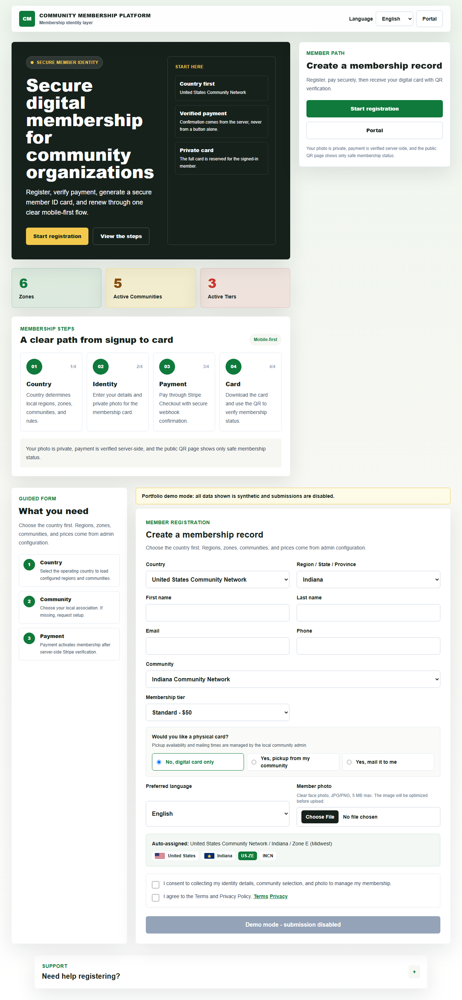
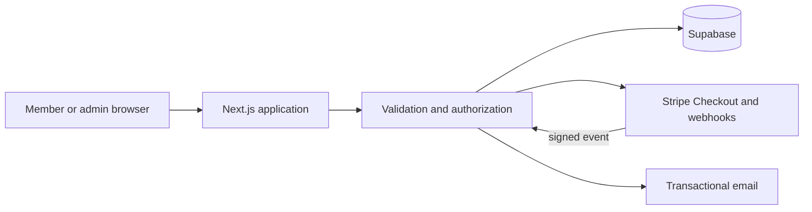

# Community Membership Platform

A privacy-first membership platform that models registration, verified
payments, scoped administration, digital credentials, and QR-based status
verification for regional community organizations.

This repository is a synthetic, fresh-history portfolio edition. It contains no
real member records, organization contacts, provider credentials, production
identifiers, or private source history. The deployed/default experience runs in
read-only showcase mode, so public visitors cannot submit personal data.



## Engineering highlights

- Next.js App Router and TypeScript with server-rendered member/admin flows.
- Configurable country, region, zone, community, tier, and card-template model.
- Supabase-ready Postgres, Auth, Storage, and row-level security migrations.
- Stripe Checkout and signature-verified webhook processing with amount,
  currency, member, email, payload-size, and idempotency checks.
- Email magic-link member access and AAL2 enforcement for MFA-required admins.
- Scope-aware authorization for global, country, region, zone, and community admins.
- Opaque verification tokens and a minimal public credential-status response.
- PNG/JPEG signature validation, private member-photo storage, and bounded uploads.
- Content Security Policy, HSTS, clickjacking protection, permission controls,
  generic authentication errors, and spreadsheet-formula neutralization.
- English/French member experience with responsive, accessible form controls.
- Protected automation for repository privacy, lint, tests, type checking,
  production builds, dependency audit, CodeQL, and dependency review.

## Architecture



The browser is never an authority for activation or administrative scope.
Provider-backed changes occur through server routes; payment success pages do
not activate memberships. See [architecture notes](docs/architecture.md),
[access controls](docs/auth-access-control.md), and the
[deployment checklist](docs/deployment.md).

## Security boundaries

- Showcase mode is on automatically when no service-role configuration exists.
  Registration, support, and account-closure submissions then return `503` and
  the UI clearly identifies the synthetic demo.
- Card access uses a dedicated 32+ character signing secret. It never reuses a
  database service-role or JWT signing secret.
- Public verification accepts an unguessable UUID, displays only a first name
  plus last initial, organization, status, and expiration, and has an abuse guard.
- Direct client access to member photos and generated cards is denied. Server
  routes authorize ownership/scope before using private storage.
- The included in-process abuse guard protects a single demonstration runtime.
  A distributed production deployment must replace it with a durable shared store.

## Run locally

Requirements: Node.js 24 and npm 11.

```bash
npm ci
cp .env.example .env.local
npm run dev
```

Open `http://localhost:3000`. The example environment enables read-only
showcase mode and contains placeholders only.

## Verification

```bash
npm run lint
npm test
npm run test:security
npm run typecheck
npm run build
npm audit --audit-level=high
```

The repository also includes current-tree and reachable-history safety gates:

```bash
npm run test:safety
npm run test:safety:history
```

Responsive browser smoke tests verify desktop/mobile layout, security headers,
read-only behavior, invalid verification handling, and clean browser consoles:

```bash
npx playwright install chromium
npm run build
npm run test:e2e
```

## Production integration boundary

The provider adapters and migrations are reference implementations, not a claim
that this public showcase is a live membership service. Before operating with
real people or payments, an owner must independently configure and test Supabase
projects, RLS, Stripe webhooks, email domains, MFA enrollment/challenge UX,
durable rate limiting, backups, retention, incident response, and applicable
privacy/payment obligations. Never use portfolio-demo data or credentials in a
production environment.

## Repository map

- `src/app`: member, credential, payment, support, and admin routes.
- `src/lib/security`: authentication, authorization, token, and lockdown boundaries.
- `src/services`: domain and provider services.
- `supabase/migrations`: schema, private storage, and RLS policies.
- `tests`: deterministic domain and security regression tests.
- `scripts`: environment, repository-safety, and architecture assertions.
- `docs`: architecture, API, deployment, operations, and testing notes.

## License and responsible disclosure

Released under the [MIT License](LICENSE). Please report security issues through
the private process in [SECURITY.md](SECURITY.md), not a public issue.
