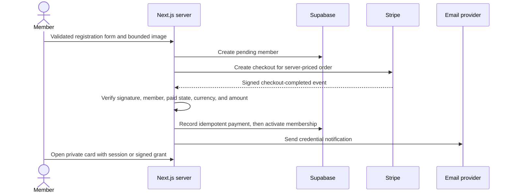

# Architecture

## Purpose

The platform demonstrates a configurable membership lifecycle while keeping
identity, payment, administrative, and public-verification concerns separated.
The public repository is a synthetic reference implementation, not a live
membership authority.

## Request flow

Browser redirects and success-page query parameters never activate a
membership. The payment webhook is the state-change authority.

## Trust boundaries

### Public boundary

- Public configuration includes active regions, communities, and tiers only.
- Registration, support, and closure inputs are schema-validated and bounded.
- Showcase mode disables all public writes when provider configuration is absent.
- Credential verification uses an opaque UUID, not the sequential member ID.
- Verification returns first name plus last initial, community, status, and expiration only.

### Member boundary

- Supabase validates the session server-side.
- Private cards require matching verified email ownership, scoped admin access,
  or a short-lived HMAC grant issued after a matching paid Stripe session.
- Member photos and generated cards have no direct client storage-read policy.

### Administrator boundary

- Admin membership comes from a server-side role record or explicit super-admin allowlist.
- MFA-required roles must have an AAL2 session.
- Data access is filtered by global, country, region, zone, or community scope.
- Member exports neutralize spreadsheet formulas and are recorded in the audit log.
- Only super admins may reconcile refunds/cancellations in the local payment record.
  The reference implementation does not claim to issue provider-side refunds.

## Data model

`country -> region -> zone -> community -> member -> membership/payment/card`

The human-readable member ID supports operations and card display. A separate
random verification token protects the public lookup boundary. Payment provider
transaction and event identifiers are unique to make webhook retries idempotent.

## Storage

- `community-assets`: public PNG/JPEG assets uploaded by scoped admins.
- `member-photos`: private; server access only after authorization.
- `cards`: private; server access only after authorization.

Uploaded photos and logos are size-bounded and checked against PNG/JPEG file
signatures. Public SVG upload is intentionally not supported.

## Deployment modes

- `showcase`: synthetic, read-only, and safe without provider credentials.
- `development`: local provider-free engineering mode.
- `staging` / `production`: require explicit Supabase, Stripe, email, HTTPS URL,
  admin allowlist, and dedicated card-signing configuration.

The included in-process rate limiter is suitable only for a single demonstration
runtime. Multi-instance deployment requires a durable shared limiter plus tested
retention, backup, alerting, and incident-response controls.
