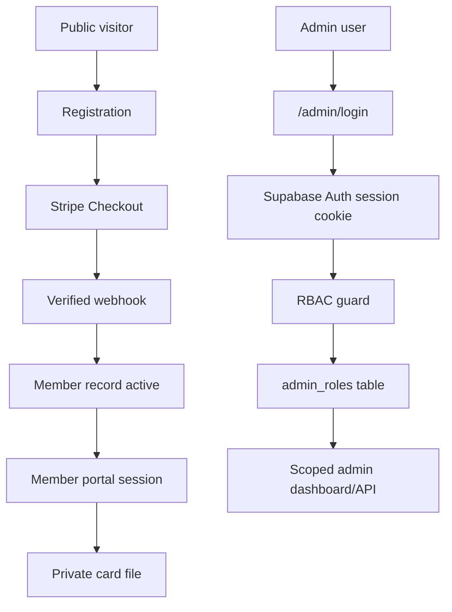

# Authentication And Access Control

## Goal

Public registration and verification stay low-friction. Admin operations, private queues, exports, and full card files require authenticated Supabase sessions and role checks.

## Stack

i Details

The Next.js app uses `@supabase/ssr` to read Supabase Auth cookies on the server. `src/proxy.ts` refreshes sessions. API routes call guards from `src/lib/security/authz.ts`. Admin identity is resolved from the authenticated Supabase user plus either `SUPER_ADMIN_EMAILS` bootstrap allowlist or the `admin_roles` table.

## Roles

- `super_admin`: global platform access.
- `country_admin`: access scoped to one country.
- `zone_admin`: access scoped to one zone.
- `region_admin`: access scoped to one region/state/province.
- `community_admin`: access scoped to one community/association.

## Protected Surfaces

- `/admin` redirects unauthenticated users to `/admin/login`.
- `/admin/config` requires `super_admin`.
- `/api/admin/*` requires authenticated admin access.
- `/api/admin/config`, `/api/admin/users`, and `/api/admin/audit` require `super_admin`.
- `/api/admin/export/members` returns only records visible to the admin scope.
- `/api/support`, `/api/reassignments`, and `/api/account-closure` queue reads require admin access.
- `/api/cards/[memberId]` requires the member owner email or a scoped admin.
- `/card/[memberId]` redirects unauthenticated users to the portal instead of exposing the full card.
- `/portal` provides passwordless member login and lists only memberships tied to the authenticated email.
- `/auth/callback` exchanges Supabase magic-link codes for app session cookies and redirects to a safe in-app path.

## Required Environment Variables

Server:

- `SUPABASE_URL`
- `SUPABASE_ANON_KEY`
- `SUPABASE_SERVICE_ROLE_KEY`
- `SUPER_ADMIN_EMAILS`

Browser login:

- `NEXT_PUBLIC_SUPABASE_URL`
- `NEXT_PUBLIC_SUPABASE_ANON_KEY`

For local development, the public values can match `SUPABASE_URL` and `SUPABASE_ANON_KEY`.

## Admin Bootstrap

1. Create a Supabase Auth user for the first admin.
2. Add that email to `SUPER_ADMIN_EMAILS` in the deployment environment.
3. Sign in at `/admin/login`.
4. Use the admin users API/config flow to create scoped admin roles.
5. After durable admin management is verified, keep at least two trusted super admins configured.

## Member Portal Magic Links

1. Enable Supabase email OTP/magic links.
2. Set Supabase Auth `Site URL` to the production app URL, not localhost:
   - `https://your-domain.example`
3. Add the deployed app callback URL to Supabase Auth redirect URLs:
   - Production: `https://your-domain.example/auth/callback`
   - Local: `http://127.0.0.1:3001/auth/callback` or the active local port.
4. Set `NEXT_PUBLIC_APP_URL` to the exact public HTTPS URL in the hosting provider.
5. Members sign in from `/portal` with the same email used during registration.
6. Supabase may create the auth user on first passwordless login.
7. The portal resolves memberships by authenticated email and only shows matching records.
8. Card pages remain private and accessible only to the matching member email or a scoped admin.

## Security Notes

- Do not accept `adminId`, `reviewedBy`, or `recordedByAdminId` from browser request bodies for privileged actions.
- Use the authenticated session user and resolved admin role as the source of truth.
- Keep public QR verification minimal: no email, phone, address, or member photo.
- Admin impersonation must always create audit logs and must never be silent.
- Stripe webhook idempotency must be database-backed. The production flow records Stripe event and transaction IDs in `payments` before membership activation, then safely continues activation on webhook retry if the payment was recorded but the member is not yet active.
